# UTSS v1.0 Schema Specification

**Universal Trading Strategy Schema - Complete Reference**

> This document defines the schema. Execution semantics are left to consuming applications.

---

## Table of Contents

1. [Overview](#overview)
2. [Design Principles](#design-principles)
3. [Schema Structure](#schema-structure)
4. [Type Definitions](#type-definitions)
5. [Enumerations](#enumerations)
6. [Extensibility](#extensibility)
7. [Examples](#examples)

---

## Overview

UTSS is a declarative schema for expressing trading strategies. A valid UTSS document contains all information needed to:

- Select which assets to trade (universe)
- Compute derived values (signals)
- Define trading logic (rules)
- Specify risk limits (constraints)
- Set evaluation schedule (schedule)

### Schema Architecture

```mermaid
graph TB
    subgraph Strategy["📄 Strategy Document"]
        Info["info"]
        Universe["universe"]
        Parameters["parameters"]
        Signals["signals"]
        Conditions["conditions"]
        Rules["rules"]
        Constraints["constraints"]
        Schedule["schedule"]
    end

    subgraph Rule["📋 Rule"]
        When["when: Condition"]
        Then["then: Action"]
    end

    subgraph SignalTypes["📊 Signal Types"]
        Price["PriceSignal"]
        Indicator["IndicatorSignal"]
        Fundamental["FundamentalSignal"]
        Calendar["CalendarSignal"]
        Event["EventSignal"]
        Portfolio["PortfolioSignal"]
        Relative["RelativeSignal"]
        Constant["ConstantSignal"]
        Expression["ExpressionSignal"]
        External["ExternalSignal"]
    end

    subgraph ConditionTypes["✅ Condition Types (v1.0 Minimal)"]
        Comparison["ComparisonCondition"]
        Logical["And/Or/Not"]
        Expression["ExpressionCondition"]
        Always["AlwaysCondition"]
    end

    subgraph ActionTypes["⚡ Action Types"]
        Trade["TradeAction"]
        Alert["AlertAction"]
        Hold["HoldAction"]
    end

    subgraph SizingTypes["📐 Sizing Types"]
        Fixed["FixedAmount"]
        FixedQty["FixedQuantity"]
        PctEquity["PercentEquity"]
        PctCash["PercentCash"]
        PctPosition["PercentPosition"]
        RiskBased["RiskBased"]
        Kelly["Kelly"]
        VolAdj["VolatilityAdjusted"]
    end

    Rules --> Rule
    When --> ConditionTypes
    Then --> ActionTypes
    Signals --> SignalTypes
    Conditions --> ConditionTypes
    Trade --> SizingTypes
    Comparison --> SignalTypes
    Expression --> SignalTypes

    Parameters -.->|"$param"| SignalTypes
    Signals -.->|"$ref"| ConditionTypes

    style Strategy fill:#e1f5fe
    style Rule fill:#fff3e0
    style SignalTypes fill:#e8f5e9
    style ConditionTypes fill:#fce4ec
    style ActionTypes fill:#f3e5f5
    style SizingTypes fill:#fff8e1
```



### Type System Overview


```
┌─────────────────────────────────────────────────────────────┐
│                      UTSS Document                          │
├─────────────────────────────────────────────────────────────┤
│  info        │ Metadata (id, name, version, author)        │
│  universe    │ What to trade                                │
│  signals     │ Named signal definitions (optional)         │
│  conditions  │ Named condition definitions (optional)      │
│  rules       │ When/then pairs (required)                  │
│  constraints │ Risk limits (optional)                      │
│  schedule    │ Evaluation timing (optional)                │
│  parameters  │ Optimizable values (optional)               │
└─────────────────────────────────────────────────────────────┘
```

---

## Design Principles

### 1. Declarative Over Imperative
Define WHAT should happen, not HOW to compute it.

```yaml
# GOOD: Declarative
when: RSI(14) < 30
then: buy 10%

# BAD: Imperative (not supported)
for each bar:
  rsi = calculate_rsi(close, 14)
  if rsi < 30:
    buy(0.10 * equity)
```

### 2. Consistent Type Discriminators
Every complex type has a `type` field for unambiguous parsing.

```yaml
signal:
  type: indicator    # Always present
  indicator: RSI
  params: { period: 14 }
```

### 3. Composition via References
Reuse components with `$ref` instead of duplication.

```yaml
signals:
  rsi_14:
    type: indicator
    indicator: RSI
    params: { period: 14 }

rules:
  - when:
      left: { $ref: "#/signals/rsi_14" }  # Reference
      operator: "<"
      right: { type: constant, value: 30 }
```

### 4. Progressive Disclosure
Simple strategies are concise; complexity is opt-in.

```yaml
# Minimal valid strategy
info: { id: simple, version: "1.0" }
universe: { type: static, symbols: [AAPL] }
rules:
  - name: Buy
    when: { type: always }
    then: { type: trade, direction: buy, sizing: { type: percent_of_equity, percent: 100 } }
```

### 5. Execution-Agnostic
Schema defines strategy logic. Execution details (slippage, fees, broker) are out of scope.

### Evaluation Flow

The conceptual evaluation flow (implemented by consuming applications):


### Data Flow


---

## Schema Structure

### Top-Level Document

```yaml
$schema: https://obichan117.github.io/universal-trading-strategy-schema/schema/v1/strategy.json  # Optional

info:          # Required - Strategy metadata
universe:      # Required - Asset selection
signals:       # Optional - Named signal definitions
conditions:    # Optional - Named condition definitions
rules:         # Required - Trading rules (min 1)
constraints:   # Optional - Risk management
schedule:      # Optional - Evaluation timing
parameters:    # Optional - Optimizable parameters
```

### Info (Required)

```yaml
info:
  id: string              # Required. Pattern: ^[a-z0-9_-]+$
  name: string            # Required. Max 100 chars
  version: string         # Required. Pattern: ^\d+\.\d+(\.\d+)?$
  description: string     # Optional. Max 2000 chars
  author:                 # Optional
    id: string
    name: string
  tags: [string]          # Optional. Max 10 items
  created_at: datetime    # Optional. ISO 8601
  updated_at: datetime    # Optional. ISO 8601
  visibility: enum        # Optional. public | private | unlisted
```

### Universe (Required)

```yaml
# Option A: Static list
universe:
  type: static
  symbols: [string]       # Required. Min 1 item

# Option B: Index-based
universe:
  type: index
  index: StockIndex       # Required. See enums
  filters: [Condition]    # Optional. Filter criteria
  rank_by: Signal         # Optional. Ranking signal
  order: asc | desc       # Optional. Default: desc
  limit: integer          # Optional. Max symbols

# Option C: Screener
universe:
  type: screener
  base: string            # Optional. Starting universe (index or "all")
  filters: [Condition]    # Required. Min 1
  rank_by: Signal         # Optional
  order: asc | desc       # Optional
  limit: integer          # Optional

# Option D: Dual (for long-short)
universe:
  type: dual
  long:                   # Same structure as index/screener
    type: index
    index: SP500
    rank_by: Signal
    limit: 50
    direction: top
  short:
    type: index
    index: SP500
    rank_by: Signal
    limit: 50
    direction: bottom
```

### Signals (Optional)

Named signal definitions for reuse.

```yaml
signals:
  signal_name:            # Key becomes reference name
    <Signal>              # Any Signal type
```

### Conditions (Optional)

Named condition definitions for reuse.

```yaml
conditions:
  condition_name:         # Key becomes reference name
    <Condition>           # Any Condition type
```

### Rules (Required)

```yaml
rules:
  - name: string          # Required. Human-readable name
    description: string   # Optional
    when: Condition       # Required. Trigger condition
    then: Action          # Required. Action to take
    priority: integer     # Optional. Higher = evaluated first. Default: 0
    enabled: boolean      # Optional. Default: true
    regime: string        # Optional. Only active in named regime
```

### Constraints (Optional)

```yaml
constraints:
  # Position limits
  max_positions: integer          # Max concurrent positions
  min_positions: integer          # Min positions (for diversification)
  max_position_size: number       # Max % of portfolio per position (0-100)

  # Stop losses
  stop_loss:
    percent: number               # Fixed % stop
    atr_multiple: number          # ATR-based stop
  trailing_stop:
    percent: number               # Trailing % from peak
    activation_percent: number    # Activate after this profit %
    atr_multiple: number          # ATR-based trailing
  time_stop:
    bars: integer                 # Exit after N bars

  # Take profit
  take_profit:
    percent: number
    atr_multiple: number

  # Portfolio limits
  max_drawdown: number            # Stop trading at this drawdown % (0-100)
  daily_loss_limit: number        # Max daily loss % (0-100)
  max_sector_exposure: number     # Max % in single sector (0-100)
  max_correlation: number         # Max correlation between positions (0-1)

  # Restrictions
  no_shorting: boolean            # Default: false
  no_leverage: boolean            # Default: true

  # Turnover
  max_daily_turnover: number      # Max % turnover per day
  min_holding_bars: integer       # Min bars before exit allowed
```

### Schedule (Optional)

```yaml
schedule:
  frequency: Frequency            # tick|1m|5m|15m|30m|1h|4h|daily|weekly|monthly
  market_hours_only: boolean      # Default: true
  timezone: string                # Default: "America/New_York" (e.g., "Asia/Tokyo")
  trading_days: [DayOfWeek]       # Default: [monday..friday]
  evaluate_at: [string]           # Specific times: ["09:30", "15:55"]
```

### Parameters (Optional)

For parameter optimization in downstream applications.

```yaml
parameters:
  param_name:
    type: integer | number | boolean | string
    default: value                # Required
    min: number                   # For numeric types
    max: number                   # For numeric types
    step: number                  # For numeric types
    choices: [value]              # For string type
    description: string           # Optional

# Usage in signals/conditions:
signals:
  rsi:
    type: indicator
    indicator: RSI
    params:
      period: { $param: param_name }  # Reference parameter
```

---

## Type Definitions

### Signal

Produces a numeric value.

```yaml
Signal:
  oneOf:
    - PriceSignal
    - IndicatorSignal
    - FundamentalSignal
    - CalendarSignal
    - EventSignal
    - PortfolioSignal
    - RelativeSignal
    - ConstantSignal
    - ExpressionSignal
    - ExternalSignal
    - Reference
    - ParameterReference
```



```mermaid
classDiagram
    class Signal {
        <<abstract>>
    }
    class PriceSignal {
        +type: "price"
        +field: PriceField
        +offset: integer
        +timeframe: Timeframe
        +symbol: string
    }
    class IndicatorSignal {
        +type: "indicator"
        +indicator: IndicatorType
        +params: object
        +offset: integer
    }
    class FundamentalSignal {
        +type: "fundamental"
        +metric: FundamentalMetric
        +symbol: string
    }
    class CalendarSignal {
        +type: "calendar"
        +field: CalendarField
    }
    class EventSignal {
        +type: "event"
        +event: EventType
        +days_before: integer
        +days_after: integer
    }
    class PortfolioSignal {
        +type: "portfolio"
        +field: PortfolioField
        +symbol: string
    }
    class RelativeSignal {
        +type: "relative"
        +signal: Signal
        +benchmark: string
        +measure: RelativeMeasure
        +lookback: integer
    }
    class ConstantSignal {
        +type: "constant"
        +value: number
    }
    class ExpressionSignal {
        +type: "expr"
        +formula: string
    }
    class ExternalSignal {
        +type: "external"
        +source: string
        +url: string
        +default: number
    }
    class Reference {
        +$ref: string
    }
    class ParameterReference {
        +$param: string
    }

    Signal <|-- PriceSignal
    Signal <|-- IndicatorSignal
    Signal <|-- FundamentalSignal
    Signal <|-- CalendarSignal
    Signal <|-- EventSignal
    Signal <|-- PortfolioSignal
    Signal <|-- RelativeSignal
    Signal <|-- ConstantSignal
    Signal <|-- ExpressionSignal
    Signal <|-- ExternalSignal
    Signal <|-- Reference
    Signal <|-- ParameterReference

    RelativeSignal o-- Signal : signal
```

#### PriceSignal

```yaml
type: price
field: PriceField           # Required. open|high|low|close|volume|vwap
offset: integer             # Optional. Bars back (0=current). Default: 0
timeframe: Timeframe        # Optional. For MTF
symbol: string              # Optional. Cross-symbol reference
```

#### IndicatorSignal

```yaml
type: indicator
indicator: IndicatorType    # Required. See enums
params:                     # Optional. Indicator-specific
  period: integer
  fast_period: integer
  slow_period: integer
  signal_period: integer
  std_dev: number
  source: open|high|low|close|hl2|hlc3|ohlc4
offset: integer             # Optional. Default: 0
timeframe: Timeframe        # Optional
symbol: string              # Optional. Cross-symbol reference
```

#### FundamentalSignal

```yaml
type: fundamental
metric: FundamentalMetric   # Required. See enums
symbol: string              # Optional
```

#### CalendarSignal

```yaml
type: calendar
field: CalendarField        # Required
# Returns 1 if matches, 0 otherwise (or actual value for some fields)
```

CalendarField options:
- `day_of_week`: Returns 1-5 (Mon-Fri)
- `day_of_month`: Returns 1-31 (or -1 for last day)
- `week_of_month`: Returns 1-5
- `month`: Returns 1-12
- `quarter`: Returns 1-4
- `year`: Returns year number
- `is_month_start`: Returns 1 or 0
- `is_month_end`: Returns 1 or 0
- `is_quarter_start`: Returns 1 or 0
- `is_quarter_end`: Returns 1 or 0

#### EventSignal

```yaml
type: event
event: EventType            # Required. See enums
days_before: integer        # Optional. Days before event
days_after: integer         # Optional. Days after event
# Returns 1 if within window, 0 otherwise
```

#### PortfolioSignal

```yaml
type: portfolio
field: PortfolioField       # Required. See below
symbol: string              # Optional. Default: current universe symbol
```

PortfolioField options:
- `position_qty`: Current position quantity (negative for short)
- `position_value`: Current position market value
- `position_side`: 1 (long), -1 (short), 0 (flat)
- `avg_entry_price`: Volume-weighted average entry
- `unrealized_pnl`: Unrealized P/L in currency
- `unrealized_pnl_pct`: Unrealized P/L as % of entry
- `realized_pnl`: Realized P/L for session
- `days_in_position`: Calendar days since entry
- `bars_in_position`: Bars since entry
- `equity`: Total account equity
- `cash`: Available cash
- `buying_power`: Available buying power
- `daily_pnl`: Today's P/L
- `daily_pnl_pct`: Today's P/L as %

#### RelativeSignal

For cross-asset or benchmark-relative comparisons.

```yaml
type: relative
signal: Signal              # Required. The signal to compare
benchmark: string           # Required. Index or symbol (e.g., "SPY", "NIKKEI225")
measure: RelativeMeasure    # Required. How to compare
lookback: integer           # Optional. Lookback period for rolling calculations
```

RelativeMeasure options:
- `ratio`: signal / benchmark (e.g., price relative strength)
- `difference`: signal - benchmark
- `beta`: Rolling beta vs benchmark
- `correlation`: Rolling correlation vs benchmark
- `percentile`: Where signal ranks vs benchmark universe
- `z_score`: Standardized score vs benchmark

**Example - Price Relative to S&P 500:**

```yaml
signals:
  relative_strength:
    type: relative
    signal: { type: price, field: close }
    benchmark: SPY
    measure: ratio
    lookback: 20

conditions:
  outperforming:
    type: comparison
    left: { $ref: "#/signals/relative_strength" }
    operator: ">"
    right: { type: constant, value: 1.0 }
```

#### ConstantSignal

```yaml
type: constant
value: number               # Required
```

#### ExpressionSignal

For custom formulas not expressible with built-in types.

```yaml
type: expr
formula: string             # Required. Expression string
# Examples:
# "(SMA(close, 20) - SMA(close, 50)) / ATR(14)"
# "close / HIGHEST(close, 52)"
# "IF(RSI(14) < 30, 1, 0)"
```

Expression language supports:
- Arithmetic: `+`, `-`, `*`, `/`, `^`
- Functions: `SMA(source, period)`, `RSI(period)`, etc.
- Conditionals: `IF(condition, then, else)`
- Comparisons: `<`, `>`, `<=`, `>=`, `==`, `!=`
- Logical: `AND`, `OR`, `NOT`

#### ExternalSignal

For runtime-resolved signals (ML models, webhooks).

```yaml
type: external
source: webhook | file | provider
url: string                 # For webhook
path: string                # For file
provider: string            # For registered provider
refresh: Frequency          # How often to refresh
default: number             # Fallback value if unavailable
```

#### Reference

```yaml
$ref: string                # JSON Pointer path
# Examples:
# "#/signals/rsi_14"
# "#/conditions/oversold"
```

#### ParameterReference

Reference to a strategy parameter defined in the `parameters` section.

```yaml
$param: string              # Parameter name
# Examples:
# { $param: rsi_period }
# { $param: oversold_threshold }
```

**Example - Parameterized RSI Strategy:**

```yaml
parameters:
  rsi_period:
    type: integer
    default: 14
    min: 5
    max: 30
    description: RSI calculation period

  oversold_level:
    type: integer
    default: 30
    min: 20
    max: 40

signals:
  rsi:
    type: indicator
    indicator: RSI
    params:
      period: { $param: rsi_period }     # Uses parameter

conditions:
  oversold:
    type: comparison
    left: { $ref: "#/signals/rsi" }
    operator: "<"
    right: { $param: oversold_level }    # Uses parameter
```

---

### Condition

Produces a boolean value.

**UTSS v1.0 uses minimal condition primitives.** Complex patterns (crossovers, ranges, temporal, sequences) are expressed via `expr` formulas. See `patterns/` directory for reusable formulas.

```yaml
Condition:
  oneOf:
    - ComparisonCondition   # Compare signals
    - AndCondition          # All must be true
    - OrCondition           # Any must be true
    - NotCondition          # Negate condition
    - ExpressionCondition   # Formula for complex patterns
    - AlwaysCondition       # Unconditional (for scheduled actions)
    - Reference             # $ref to named condition
```


#### ComparisonCondition

```yaml
type: comparison
left: Signal                # Required
operator: ComparisonOp      # Required. <|<=|=|>=|>|!=
right: Signal               # Required
```

#### AndCondition

```yaml
type: and
conditions: [Condition]     # Required. Min 2
```

#### OrCondition

```yaml
type: or
conditions: [Condition]     # Required. Min 2
```

#### NotCondition

```yaml
type: not
condition: Condition        # Required
```

#### ExpressionCondition

For complex patterns not expressible with primitives. Use for crossovers, ranges, temporal conditions, sequences, etc.

```yaml
type: expr
formula: string             # Required. Boolean expression
```

**Example formulas** (see `patterns/` for more):

```yaml
# Cross above: SMA(50) crosses above SMA(200)
formula: "SMA(50)[-1] <= SMA(200)[-1] and SMA(50) > SMA(200)"

# Range: RSI between 30 and 70
formula: "RSI(14) > 30 and RSI(14) < 70"

# Temporal: RSI oversold for 3 consecutive bars
formula: "all(RSI(14) < 30, bars=3)"

# Sequence: RSI oversold then price bounce
formula: "RSI(14)[-5:-1].min() < 30 and close > close[-1] * 1.02"
```

Expression language supports:
- Arithmetic: `+`, `-`, `*`, `/`, `^`
- Comparisons: `<`, `>`, `<=`, `>=`, `==`, `!=`
- Logical: `and`, `or`, `not`
- Indexing: `signal[-1]` (1 bar ago), `signal[-5:-1]` (range)
- Functions: `min()`, `max()`, `all()`, `any()`, `abs()`
- Indicators: `SMA(period)`, `RSI(period)`, `ATR(period)`, etc.

#### AlwaysCondition

```yaml
type: always
# Always evaluates to true. Useful for scheduled rebalancing.
```

---

### Action

What to do when condition is met.

```yaml
Action:
  oneOf:
    - TradeAction
    - AlertAction
    - HoldAction
```


#### TradeAction

```yaml
type: trade
direction: buy | sell | short | cover  # Required
symbol: string              # Optional. Default: current universe symbol
sizing: Sizing              # Required
order_type: OrderType       # Optional. Default: market
limit_price: Signal         # Optional. For limit orders
stop_price: Signal          # Optional. For stop orders
time_in_force: TimeInForce  # Optional. Default: day
```

#### AlertAction

```yaml
type: alert
message: string             # Required. Supports placeholders: {symbol}, {price}, {indicator:NAME}
level: info | warning | critical  # Optional. Default: info
channels: [Channel]         # Optional. Default: [log]
throttle_minutes: integer   # Optional. Min minutes between repeated alerts
```

Channel options: `log`, `webhook`, `email`, `sms`, `telegram`, `discord`, `slack`

#### HoldAction

```yaml
type: hold
reason: string              # Optional. Explanation for why holding
```

---

### Sizing

How much to trade.

```yaml
Sizing:
  oneOf:
    - FixedAmountSizing
    - FixedQuantitySizing
    - PercentEquitySizing
    - PercentCashSizing
    - PercentPositionSizing
    - RiskBasedSizing
    - KellySizing
    - VolatilityAdjustedSizing
```


#### FixedAmountSizing

```yaml
type: fixed_amount
amount: number              # Required. Currency amount
currency: string            # Optional. Default: USD
```

#### FixedQuantitySizing

```yaml
type: fixed_quantity
quantity: number            # Required. Number of shares/contracts
```

#### PercentEquitySizing

```yaml
type: percent_of_equity
percent: number             # Required. 0-100
```

#### PercentCashSizing

```yaml
type: percent_of_cash
percent: number             # Required. 0-100
```

#### PercentPositionSizing

```yaml
type: percent_of_position
percent: number             # Required. 0-100
```

#### RiskBasedSizing

```yaml
type: risk_based
risk_percent: number        # Required. % of equity to risk (0-100)
stop_distance: Signal       # Required. Distance to stop in price units
```

#### KellySizing

```yaml
type: kelly
fraction: number            # Optional. Fraction of Kelly (0-1). Default: 0.5
lookback: integer           # Optional. Bars for win rate calc. Default: 100
```

#### VolatilityAdjustedSizing

```yaml
type: volatility_adjusted
target_volatility: number   # Required. Target annualized vol
lookback: integer           # Optional. Default: 20
```

---

## Enumerations

All enumerations follow the **extensible enum pattern**: core values are guaranteed portable, while prefixed values provide extensibility.

### Closed Enums (Fixed Values)

These enums are closed and do not support extensions:

#### Timeframe

```
tick | 1m | 5m | 15m | 30m | 1h | 4h | daily | weekly | monthly
```

#### DayOfWeek

```
monday | tuesday | wednesday | thursday | friday
```

#### PriceField

```
open | high | low | close | volume | vwap
```

#### OrderType

```
market | limit | stop | stop_limit
```

#### TimeInForce

```
day | gtc | ioc | fok
```

#### ComparisonOp

```
< | <= | = | >= | > | !=
```

---

### Extensible Enums (Open for Extensions)

These enums support namespaced extensions via prefixes.

#### IndicatorType

**Core Values (Portable):**

| Category | Indicators |
|----------|------------|
| Moving Averages | `SMA`, `EMA`, `WMA`, `DEMA`, `TEMA`, `KAMA`, `HULL`, `VWMA` |
| Momentum | `RSI`, `MACD`, `MACD_SIGNAL`, `MACD_HIST`, `STOCH_K`, `STOCH_D`, `STOCH_RSI`, `ROC`, `MOMENTUM`, `WILLIAMS_R`, `CCI`, `MFI`, `CMO`, `TSI` |
| Trend | `ADX`, `PLUS_DI`, `MINUS_DI`, `AROON_UP`, `AROON_DOWN`, `AROON_OSC`, `SUPERTREND`, `PSAR` |
| Volatility | `ATR`, `STDDEV`, `VARIANCE`, `BB_UPPER`, `BB_MIDDLE`, `BB_LOWER`, `BB_WIDTH`, `BB_PERCENT`, `KC_UPPER`, `KC_MIDDLE`, `KC_LOWER`, `DC_UPPER`, `DC_MIDDLE`, `DC_LOWER` |
| Volume | `OBV`, `VWAP`, `AD`, `CMF`, `KLINGER` |
| Price Patterns | `HIGHEST`, `LOWEST`, `RETURN`, `DRAWDOWN` |
| Statistical | `ZSCORE`, `PERCENTILE`, `RANK`, `CORRELATION`, `BETA` |
| Ichimoku | `ICHIMOKU_TENKAN`, `ICHIMOKU_KIJUN`, `ICHIMOKU_SENKOU_A`, `ICHIMOKU_SENKOU_B`, `ICHIMOKU_CHIKOU` |

**Extension Prefixes:**

| Prefix | Pattern | Example | Use Case |
|--------|---------|---------|----------|
| `custom:` | `custom:[a-zA-Z0-9_]+` | `custom:MY_SUPERTREND` | User-defined indicators |
| `talib:` | `talib:[A-Z0-9_]+` | `talib:CDLHAMMER` | TA-Lib candle patterns |
| `platform:` | `platform:[a-z]+:[a-zA-Z0-9_]+` | `platform:tradingview:SQUEEZE` | Platform-specific |

#### FundamentalMetric

**Core Values (Portable):**

| Category | Metrics |
|----------|---------|
| Valuation | `PE_RATIO`, `PB_RATIO`, `PS_RATIO`, `PEG_RATIO`, `EV_EBITDA`, `EARNINGS_YIELD` |
| Profitability | `ROE`, `ROA`, `ROIC`, `PROFIT_MARGIN`, `OPERATING_MARGIN`, `NET_MARGIN` |
| Dividend | `DIVIDEND_YIELD`, `PAYOUT_RATIO` |
| Size & Growth | `MARKET_CAP`, `ENTERPRISE_VALUE`, `REVENUE`, `EBITDA`, `NET_INCOME`, `EPS`, `EPS_GROWTH`, `REVENUE_GROWTH` |
| Financial Health | `DEBT_TO_EQUITY`, `CURRENT_RATIO`, `QUICK_RATIO`, `INTEREST_COVERAGE` |
| Quality | `F_SCORE`, `ALTMAN_Z` |
| Other | `INDEX_WEIGHT`, `FREE_FLOAT`, `SHORT_INTEREST`, `ANALYST_RATING`, `PRICE_TARGET`, `EARNINGS_SURPRISE` |

**Extension Prefixes:**

| Prefix | Pattern | Example | Use Case |
|--------|---------|---------|----------|
| `custom:` | `custom:[a-zA-Z0-9_]+` | `custom:MODIFIED_ALTMAN_Z` | User-defined metrics |
| `provider:` | `provider:[a-z]+:[a-zA-Z0-9_]+` | `provider:bloomberg:WACC` | Data provider-specific |

#### EventType

**Core Values (Portable):**

```
EARNINGS_RELEASE | DIVIDEND_EX_DATE | DIVIDEND_PAY_DATE | STOCK_SPLIT |
IPO | DELISTING | FDA_APPROVAL | PRODUCT_LAUNCH | INDEX_ADD | INDEX_REMOVE |
INSIDER_BUY | INSIDER_SELL | ANALYST_UPGRADE | ANALYST_DOWNGRADE |
SEC_FILING_10K | SEC_FILING_10Q | SEC_FILING_8K
```

**Extension Prefixes:**

| Prefix | Pattern | Example | Use Case |
|--------|---------|---------|----------|
| `custom:` | `custom:[a-zA-Z0-9_]+` | `custom:PRODUCT_RECALL` | User-defined events |
| `calendar:` | `calendar:[a-zA-Z0-9_]+` | `calendar:FOMC_DECISION` | Economic calendar events |

#### StockIndex

**Core Values (Portable):**

| Region | Indices |
|--------|---------|
| Japan | `NIKKEI225`, `TOPIX`, `TOPIX100`, `TOPIX500`, `JPXNIKKEI400`, `TSE_PRIME`, `TSE_STANDARD`, `TSE_GROWTH`, `TOPIX_LARGE70`, `TOPIX_MID400`, `TOPIX_SMALL`, `MOTHERS` |
| US | `SP500`, `NASDAQ100`, `DOW30`, `RUSSELL2000`, `RUSSELL1000`, `SP400`, `SP600` |
| Europe | `FTSE100`, `DAX40`, `CAC40`, `STOXX50`, `STOXX600` |
| Asia-Pacific | `HANG_SENG`, `SSE50`, `CSI300`, `KOSPI`, `KOSDAQ`, `TWSE`, `ASX200` |
| Global | `MSCI_WORLD`, `MSCI_EM`, `MSCI_ACWI`, `MSCI_EAFE` |

**Extension Prefixes:**

| Prefix | Pattern | Example | Use Case |
|--------|---------|---------|----------|
| `custom:` | `custom:[a-zA-Z0-9_]+` | `custom:MY_WATCHLIST` | User-defined lists |
| `etf:` | `etf:[A-Z0-9]+` | `etf:SPY` | ETF as universe source |
| `sector:` | `sector:[A-Z0-9_]+` | `sector:TECHNOLOGY` | Sector-based universes |

---

## Extensibility

UTSS uses a **layered extensibility model** that balances portability with flexibility. This design is inspired by protocols like [FIX](https://www.fixtrading.org/standards/user-defined-fields/) (registered tag ranges) and [Protocol Buffers](https://protobuf.dev/programming-guides/enum/) (open enums with unknown value handling).

### Extensibility Philosophy

```
┌─────────────────────────────────────────────────────────────────┐
│                    EXTENSIBILITY LAYERS                         │
├─────────────────────────────────────────────────────────────────┤
│  Layer 1: Core Enums     │ Portable, all engines MUST support  │
│  Layer 2: Namespaced     │ custom:, talib:, platform:, etc.    │
│  Layer 3: Expressions    │ type: expr with formula string      │
│  Layer 4: External       │ type: external for runtime signals  │
│  Layer 5: x-extensions   │ Platform-specific, ignored by spec  │
└─────────────────────────────────────────────────────────────────┘
```

### Layer 1: Core Enums (Portable)

All values in the core enum lists are **guaranteed portable**. Every UTSS-compliant engine MUST support them.

```yaml
indicator: RSI              # Core - all engines support
metric: PE_RATIO            # Core - all engines support
index: SP500                # Core - all engines support
```

### Layer 2: Namespaced Extensions (Semi-Portable)

For values not in the core enum, use namespaced prefixes:

| Prefix | Purpose | Example |
|--------|---------|---------|
| `custom:` | User-defined | `custom:MY_SUPERTREND` |
| `talib:` | TA-Lib indicators | `talib:CDLHAMMER` |
| `platform:` | Platform-specific | `platform:tradingview:SQUEEZE` |
| `provider:` | Data provider | `provider:bloomberg:WACC` |
| `calendar:` | Economic events | `calendar:FOMC_DECISION` |
| `etf:` | ETF as universe | `etf:SPY` |
| `sector:` | Sector universe | `sector:TECHNOLOGY` |

**Engine behavior for namespaced values:**
- Engine MAY support the value
- Engine SHOULD log a warning if unsupported
- Engine MUST NOT fail validation (schema allows the pattern)

**Example:**

```yaml
signals:
  # Core indicator - guaranteed support
  rsi:
    type: indicator
    indicator: RSI
    params: { period: 14 }

  # Custom indicator - engine may or may not support
  squeeze:
    type: indicator
    indicator: platform:tradingview:SQUEEZE_MOMENTUM
    params: { length: 20 }

  # TA-Lib candle pattern
  hammer:
    type: indicator
    indicator: talib:CDLHAMMER
```

### Layer 3: Expression Language

For calculations not expressible with built-in indicators:

```yaml
signals:
  custom_ratio:
    type: expr
    formula: "(SMA(close, 20) - SMA(close, 50)) / ATR(14)"
```

Expression language supports:
- Arithmetic: `+`, `-`, `*`, `/`, `^`
- Functions: `SMA(source, period)`, `RSI(period)`, etc.
- Conditionals: `IF(condition, then, else)`
- Comparisons: `<`, `>`, `<=`, `>=`, `==`, `!=`
- Logical: `AND`, `OR`, `NOT`

Execution engines must implement an expression parser.

### Layer 4: External Signals

For runtime-resolved values (ML models, webhooks, files):

```yaml
signals:
  ml_prediction:
    type: external
    source: webhook
    url: "https://api.mymodel.com/predict"
    refresh: daily
    default: 0.5
```

Execution engines must implement HTTP client / file reader.

### Layer 5: x-extensions

For platform-specific metadata (ignored by schema validation):

```yaml
x-backtest:
  slippage_pct: 0.1
  commission_pct: 0.05

x-live:
  broker: sbi
  account_type: margin
```

### Adding New Core Values

To add a value to core enums:
1. Submit proposal to UTSS specification
2. Value is reviewed for broad applicability
3. If accepted, added in next schema version
4. Until then, use `custom:` prefix

### Portability Matrix

| Layer | Validation | Portability | LLM-Friendly |
|-------|------------|-------------|--------------|
| Core enum | ✅ Strict | ✅ All engines | ✅ High |
| `custom:` prefix | ✅ Pattern | ⚠️ Engine-dependent | ✅ High |
| `platform:` prefix | ✅ Pattern | ❌ Platform-specific | ⚠️ Medium |
| `expr:` formula | ✅ Type | ⚠️ Parser-dependent | ⚠️ Medium |
| `external:` | ✅ Type | ⚠️ Runtime-dependent | ⚠️ Medium |
| `x-*` | ❌ Ignored | ❌ Non-portable | ❌ Low |

---

## Examples

### Minimal Strategy

```yaml
info:
  id: minimal
  name: Minimal Strategy
  version: "1.0"

universe:
  type: static
  symbols: [7203.T]  # Toyota

rules:
  - name: Always hold
    when: { type: always }
    then:
      type: trade
      direction: buy
      sizing: { type: percent_of_equity, percent: 100 }
```

### RSI Mean Reversion

```yaml
info:
  id: rsi_reversal
  name: RSI Mean Reversion
  version: "1.0"
  tags: [mean-reversion, RSI]

universe:
  type: static
  symbols: [AAPL, MSFT, GOOGL]

signals:
  rsi_14:
    type: indicator
    indicator: RSI
    params: { period: 14 }

conditions:
  oversold:
    type: comparison
    left: { $ref: "#/signals/rsi_14" }
    operator: "<"
    right: { type: constant, value: 30 }

  overbought:
    type: comparison
    left: { $ref: "#/signals/rsi_14" }
    operator: ">"
    right: { type: constant, value: 70 }

rules:
  - name: Buy oversold
    when: { $ref: "#/conditions/oversold" }
    then:
      type: trade
      direction: buy
      sizing: { type: percent_of_equity, percent: 10 }
    priority: 1

  - name: Sell overbought
    when: { $ref: "#/conditions/overbought" }
    then:
      type: trade
      direction: sell
      sizing: { type: percent_of_position, percent: 100 }
    priority: 2

constraints:
  max_positions: 5
  stop_loss: { percent: 5 }
  take_profit: { percent: 15 }

schedule:
  frequency: daily
  market_hours_only: true
  timezone: America/New_York
```

### Nikkei Momentum with Hedge

```yaml
info:
  id: nikkei_momentum_hedged
  name: Nikkei 225 Momentum with RSI Hedge
  version: "1.0"
  tags: [japan, momentum, hedged]

parameters:
  momentum_lookback:
    type: integer
    default: 126
    min: 60
    max: 252
  top_n:
    type: integer
    default: 5
    min: 3
    max: 10
  hedge_rsi_threshold:
    type: integer
    default: 70
    min: 60
    max: 80

universe:
  type: index
  index: NIKKEI225
  rank_by:
    type: indicator
    indicator: RETURN
    params: { period: { $param: momentum_lookback } }
  limit: { $param: top_n }

signals:
  nikkei_etf_rsi:
    type: indicator
    indicator: RSI
    params: { period: 14 }
    symbol: 1321.T

conditions:
  etf_overbought:
    type: comparison
    left: { $ref: "#/signals/nikkei_etf_rsi" }
    operator: ">"
    right: { type: constant, value: { $param: hedge_rsi_threshold } }

  etf_recovered:
    type: comparison
    left: { $ref: "#/signals/nikkei_etf_rsi" }
    operator: "<"
    right: { type: constant, value: 50 }

  not_hedged:
    type: comparison
    left: { type: portfolio, field: position_qty, symbol: 1321.T }
    operator: "="
    right: { type: constant, value: 0 }

  is_hedged:
    type: comparison
    left: { type: portfolio, field: position_qty, symbol: 1321.T }
    operator: "<"
    right: { type: constant, value: 0 }

rules:
  - name: Monthly buy
    when:
      type: calendar
      field: is_month_start
    then:
      type: trade
      direction: buy
      sizing: { type: percent_of_equity, percent: 20 }
    priority: 1

  - name: Activate hedge
    when:
      type: and
      conditions:
        - { $ref: "#/conditions/etf_overbought" }
        - { $ref: "#/conditions/not_hedged" }
    then:
      type: trade
      direction: short
      symbol: 1321.T
      sizing: { type: percent_of_equity, percent: 30 }
    priority: 2

  - name: Remove hedge
    when:
      type: and
      conditions:
        - { $ref: "#/conditions/etf_recovered" }
        - { $ref: "#/conditions/is_hedged" }
    then:
      type: trade
      direction: cover
      symbol: 1321.T
      sizing: { type: percent_of_position, percent: 100 }
    priority: 3

constraints:
  max_positions: 6
  stop_loss: { percent: 10 }
  no_leverage: false

schedule:
  frequency: daily
  market_hours_only: true
  timezone: Asia/Tokyo
```

### Monthly DCA Portfolio

```yaml
info:
  id: monthly_dca
  name: Monthly Dollar-Cost Averaging
  version: "1.0"
  tags: [portfolio, dca]

universe:
  type: static
  symbols: [SPY, TLT, GLD, VNQ]

rules:
  - name: Monthly buy
    when:
      type: calendar
      field: is_month_start
    then:
      type: trade
      direction: buy
      sizing: { type: percent_of_cash, percent: 25 }

constraints:
  max_drawdown: 15

schedule:
  frequency: daily
  timezone: America/New_York
```

---

## Version History

| Version | Date | Changes |
|---------|------|---------|
| 1.0.0 | 2024-01 | Initial release with signals, conditions, rules |
| 1.0.0 | 2024-01 | Portfolio signals, expressions, parameters, extended indicators/indices, alerts |

---

## References

- JSON Schema Draft-07: https://json-schema.org/draft-07/schema
- ISO 8601 Datetime: https://en.wikipedia.org/wiki/ISO_8601
- IANA Timezone Database: https://www.iana.org/time-zones
